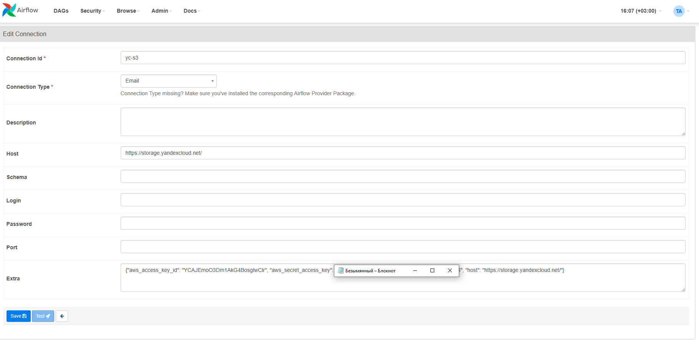

# ДЗ № 4
**Цель работы**: В данном домашнем задании Вы потренируетесь в организации периодического запуска процедуры очистки данных с помощью инструмента Apache Airflow, познакомитесь с концепцией ориентированных направленных графов (DAGs), с помощью которых организуется последовательность запуска задач по расписанию, научитесь разрабатывать собственные графы с помощью языка Python для Apache Airflow.

## Общий подход
Для решения этой задачи воспользуюсь встроенным в коробоку Airflow провайдером yandex. Этот провайдер содержит оператоторы, которые позволяют сделать следующие шаги:

1. Создать временный кластер для обработки данных
2. Запустить на этом кластере job/задание по обработке
3. Удалить временный кластер

Для управления DAG я создала сервисный аккаунт, которому добавила роли, нкобходимые для выполнения описанных выше задач.


Для подключения это аккаунта в Airflow созданы 2 ключа:
1. Для s3 статический ключ
2. Для всего сервисного аккаунта - авторизованный ключ, который позволит Airflow создавать и удалять кластеры + jobs

## 1. Запустить Airflow и создать подключения
Запускать Airflow я буду на ВМ. На основе сгенерированных для сервисного аккаунта ключей я сделала 3 подключения:
1. для подключения к бакетам s3 будут использоваться статические ключи:
2. 


4. для подключения сервисного аккаунта для создания кластера и job будет использоваться аторизованный ключ в формате json, который я сохранила вместе с DAG


## 2. Создать DAG для запуска скрипта по очистке датасета
Для работы со скриптом, который сохранен в бакете Object Storage, подготовлен DAG data_proc.py, который можно посмотреть [здесь](https://github.com/shakhovak/MLOps_HW/blob/master/HW_4/data_proc.py).


В нем использованы 3 оператора от провайдера yandex (детально про провайдера можно почитать [здесь](https://airflow.apache.org/docs/apache-airflow-providers-yandex/2.2.0/_api/airflow/providers/yandex/operators/yandexcloud_dataproc/index.html)):

1. ```DataprocCreateClusterOperator``` , который позволяет создавать кластер HDFS в Data Proc. 
2. ```DataprocCreatePysparkJobOperator```, который создает и запускает job на имеющемся в каталоге кластере. Реализовано на основе spark-submit. В качестве скрипта для job используется скрипт по очистке данных, который можно посмотреть вот [здесь](https://github.com/shakhovak/MLOps_HW/blob/master/HW_4/pyspark_script.py).
3. ```DataprocDeleteClusterOperator```, который удаляет созданный кластер после завершения job.

## 3. Запустить DAG и получить 3 автоматические обработки.
Основная задача DAG создать кластер и запустить на нем задание. Задание включает обработку csv файла и сохранение обработанного файла в папке processed с указанием даты и времени обработки.

DAG запускался каждые 16 минут, как показано на рисунке ниже.


В истории операций Data Proc c кластерами отражается создание и удалнеи кластеров и соответствующих jobs.


Также в папке processed были сохранены соответсвующие файлы. В рамках учебной задачи я использовала один и тот же файл для всех запусков DAG. В рамках этой задачи не получилось добавить новых провайдеров для добавления сенсоров в качестве триггеров запуска DAG и удаление/перемещение исходного файла.


