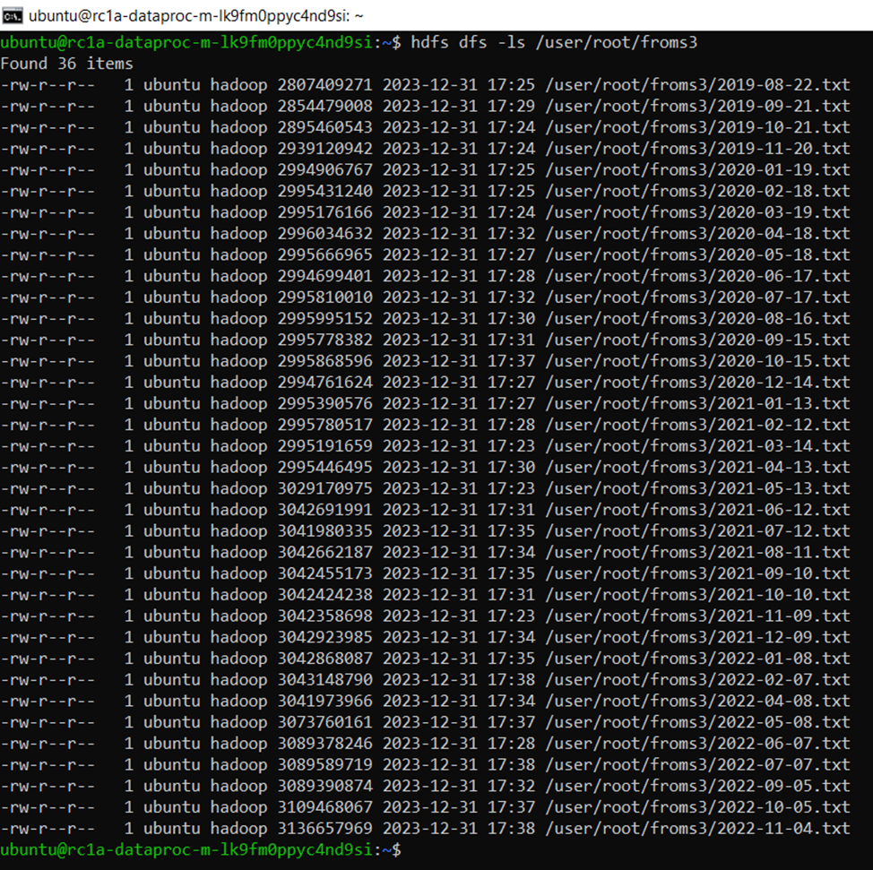

# ДЗ2
**1. Создать бакет в Yandex Cloud Object Storage и скопировать в него файлы из хранилища s3://mlops-data/fraud-data/**

## Решение:
Бакет с публичным доступом создан из UI Yandex Cloud Object Storage s3://mlopsshakhova .
Данные скопированы через cmd с помощью команды ```aws s3 --endpoint-url=https://storage.yandexcloud.net  cp s3://mlops-data/fraud-data/ s3://mlopsshakhova --copy-props none –recursive```

Я не стала использовать s3cmd, так как получила отклик с отказом в доступе. Как я поняла, есть проблемы с копированием публичных файлов, поэтому воспользовалась аналогоа aws.

Дополнительно с помощью команды ```aws s3 --endpoint-url=https://storage.yandexcloud.net ls  --recursive s3://mlops-data/fraud-data/ --summarize > bucket-contents-source.txt```

и команды ```aws s3 --endpoint-url=https://storage.yandexcloud.net ls  --recursive s3://mlopsshakhova/ --summarize > bucket-contents-target.txt```

сформировала списки файлов в начальной и финальной директориях для проверки полноты копирования. Файлы приложены [здесь](https://github.com/shakhovak/MLOps_HW/blob/master/bucket-contents-source.txt) и [здесь](https://github.com/shakhovak/MLOps_HW/blob/master/bucket-contents-target.txt).

**2. Создать Spark-кластер в Data Proc с двумя подкластерами со следующими характеристиками:**
    - Мастер-подкластер: класс хоста s3-c2-m8, размер хранилища 40 ГБ.
    - Data-подкластер: класс хоста s3-c4-m16, 3 хоста, размер хранилища 128 ГБ.
    
## Решение:
Кластер создан, но в процессе копирования у него появились проблемы с доступностью, но я решила не перезапускать кластер.

Кластер после получения принт-скрина удалила.


**3. Подключиться к созданному кластеру по SSH и скопировать файлы из s3 хранилища в файловую систему кластера.**

## Решение:
Подключение по ssh через cmd c помощью команды ```ssh ubuntu@51.250.82.79```.
Копирование файлов с помощью команды ```hadoop distcp  s3a://mlopsshakhova/ hdfs://rc1a-dataproc-m-lk9fm0ppyc4nd9si.mdb.yandexcloud.net/user/root/froms3```

К сожалению, процесс превался на 87%, так как у хоста появились проблемы с доступностью.

В итоге из необходимых 40 файлов скопировались только 36.



Я решила не создавать новый кластер и не перезапускать процесс, так как большую часть файлов получилось скопировать.

Если говорить о расходах, то содеражние кластера обходится намного дороже, чем хранилища s3. Ниде расходы за 1 день хранения s3 и несколько часов работы кластера.


<hr>

# ДЗ1
**Цель работы.** В данном домашнем задании Вы потренируетесь формализовывать поставленные бизнесом задачи анализа данных, определять цели
и способы их достижения, декомпозировать систему анализа данных и визуализировать задачи с использованием канбан-доски в GitHub Projects. Детальное описание задания [здесь](https://github.com/shakhovak/MLOps_HW/blob/master/HW1_desc.pdf).

# Предлагаемое решение
## 1.	Цели проектируемой антифрод-системы
Увеличение числа случаев мошеннических операций при проведении банковских транзакций требует усиления мер безопасности в компании. Для повышения скорости и количества обрабатываемой информации требуется **автоматизация** поддержки работы департамента риск-менеджмента. Для этой цели предлагается разработать систему классификации всех банковских транзакций на мошеннические и законные в режиме реального времени. Система будет блокировать потенциально мошенническую операцию при определенном уровне уверенности, пограничные транзакции продолжат анализироваться в ручном режиме при первичной блокировке системой. 
Система будет основана на модели/моделях машинного обучения. Для обучения модели планируется использовать исторические данные. В рамках тестирования и эксплуатации данные будут пополняться. Предлагается систематический контроль качества работы системе в инференсе с помощью метрик.


## 2.	Метрики машинного обучения
Антифрод-система будет классифицировать каждую транзакцию на мошенническую (возьмем значение 1 в качестве характеристики для таких транзакций) или нет (возьмем значение 0). Для компании важно, чтобы ошибки модели при классификации на превышали рыночных уровней как показано на рис. 1. В качестве целевой метрики в такой ситуации лучше рассматривать F1 Score, как основную, но также рассчитывать Recall и Precision. Чтобы не превышать минимальных порогов по количеству False negative и False positive предсказаний, Precision не должен быть меньше 98%, а Recall не меньше 95%. При этом F1 Score не меньше 96%. 
На данном этапе очень сложно оценить реалистичность данных пороговых метрик, но в принципе это довольно высокие требования, что имеет смысл озвучить Заказчику.

Рисунок 1.


Для Заказчика также важно абсолютное значение False Positive. Данным показателем можно дополнить систему метрик. Это требование надо будет учесть и про проектировании порога уверенности моделей. Так как модели будут предсказывать принадлежнсоть к классу с определенной вероятностью/уверенностью, нужно в инференсе добавить определенные правила в зависимости от величины подозрительной транзакции.

## 3.	Особенности проекта


- :pencil: **Конфиденциальность данных**: в проекте используются персональные данные клиентов компании. Необходимо продумать решения по замене персональной информации (по возможности) и/или внесение ограничений по доступам к данным. Может понадобиться работа с юридическим отделом компании.
- :pencil: **Период данных для обучения**: необходимо проанализировать, насколько поменялась ситуация на рынке и какие данные следует использовать для обучения моделей. Если в исторических данных слишком мало данных о мошеннических транзакциях, следует подумать о способах аугментации данных.
- :pencil:**Бюджет**: ограниченный бюджет в 10 млн руб + заработная плата специалистов. Необходимо оценить, какая часть бюджета будет использоваться на этапе исследования (так как это будут не возвратные затраты в случае закрытия проекта), какая на этапе обучения и тестирования. Необходимо продумать бюджет на использование системы.
- :pencil: **Сроки**: 3 месяца отводится на исследование и представление начальных результатов. В целом проект не может занять более 6 месяцев.
- :pencil: **Ключевые участники**: среди отделов компании на всех этапах проекта необходимо участие отдела риск менеджмента, который непосредственно будет работать с системой.
При подготовке данных может потребоваться помощь отдела, связанного с данными, а также и юридического. 
- :pencil:**Партнеры**: основные внешние партнеры могут включать провайдеров облачных хранилищ и серверов для размещения готовой модели и обработанных данных. Одно из требований – масштабируемость, так как в компании может резко увеличиваться количество транзакций в зависимости от сезонности.
- :pencil: **Вычислительные мощности**: необходимо оценить ресурсы для обучения модели, а также для ее инференса. Очевидно, что модель в инференсе должна работать достаточно быстро. В основном это зависит от выбранной модели, но ресурсы при размещении модели также оказывают существенную роль.
- :pencil:**Выбор модели**: модель будет подбираться для задачи бинарной классификации. Необходимо определить baseline и провести исследования, какие модели имеет смысл использовать. 
- :pencil:**Обучение**: при обучении необходимо получить доказательства, является ли метрика необхомая руководству достижимой только с помощью модели. Или необходимо добавить несколько процессов в пайплайн для необходимого уровня.

testing changes


